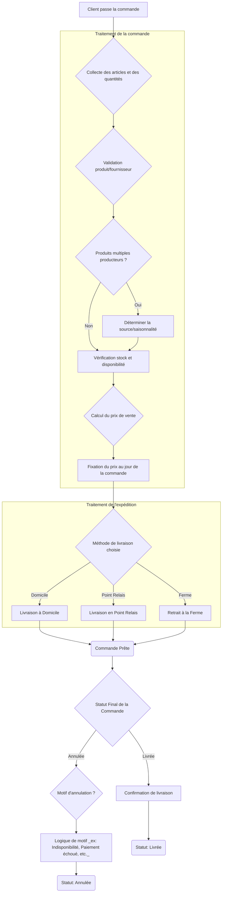

# FraichExpress

## Cahier des charges proposé par la directrice de Fraich'Express

```txt
FraîchExpress vend des produits issus de producteurs partenaires. Un client passe des commandes, chaque commande contenant un ou plusieurs produits en certaines quantités. Les prix évoluent au cours de l'année : ce que paie le client doit rester celui du jour de la commande. Une commande est livrée à domicile, dans un point relais, ou retirée à la ferme. Certains produits peuvent provenir de plusieurs producteurs selon la saison. Nous voulons connaître, pour chaque commande, si elle a été livrée ou annulée, et pourquoi.
```



* Se préoccuper des surrogate_key à l'insertion des données

## Règles de gestion

* 1 client commande 1 ou plusieurs produits en 1 ou plusieurs exemplaires à 1 date précise, qui conditionne le prix retenu pour la facturation

* 1 produit peut être fourni par 1 ou plusieurss producteurs en fonction de la saison

* 1 commande enregistre 1 ligne par client, par produit, par commande

* 1 commande ne peut exister que si le client existe dans clean_clients