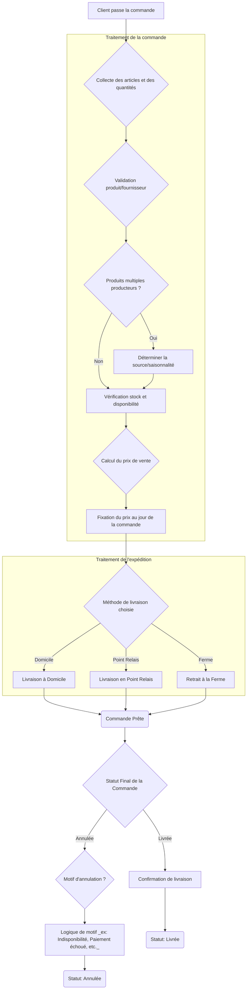

# FraichExpress

## Cahier des charges proposé par la directrice de Fraich'Express

```txt
FraîchExpress vend des produits issus de producteurs partenaires. Un client passe des commandes, chaque commande contenant un ou plusieurs produits en certaines quantités. Les prix évoluent au cours de l'année : ce que paie le client doit rester celui du jour de la commande. Une commande est livrée à domicile, dans un point relais, ou retirée à la ferme. Certains produits peuvent provenir de plusieurs producteurs selon la saison. Nous voulons connaître, pour chaque commande, si elle a été livrée ou annulée, et pourquoi.
```



## Règles de gestion

* 1 client commande 1 ou plusieurs produits en 1 ou plusieurs exemplaires à 1 date précise, qui conditionne le prix retenu pour la facturation

* 1 produit peut être fourni par 1 ou plusieurss producteurs en fonction de la saison

* 1 commande enregistre 1 ligne par client, par produit

* 1 commande ne peut exister que si le client existe dans clean_clients - CONTRAINTE

* la disponibilité des produits est conditionnée par les producteurs et la saisonnalité.

## Modélisations des données

### Dictionnaire de données 'métiers'

> Se préoccuper des surrogate_key à l'insertion des données

#### Table : ```clients```

| Nom de la colonne | Type de donnée |   Contraintes    |              Description              |
| :---------------: | :------------: | :--------------: | :-----------------------------------: |
|    uid_client     | INTEGER<br>AI  |   PRIMARY KEY    | Identifiant interne unique du client. |
|     id_client     |  VARCHAR(30)   | NOT NULL, UNIQUE |    Identifiant externe du client.     |
|        nom        |  VARCHAR(50)   |     NOT NULL     |       Nom de famille du client.       |
|      prenom       |  VARCHAR(30)   |     NOT NULL     |           Prénom du client.           |
|       email       |  VARCHAR(30)   |     NOT NULL     |       Adresse e-mail du client.       |
| date_inscription  |      DATE      |     NOT NULL     |     Date d'inscription du client.     |
|       ville       |  VARCHAR(30)   |     NOT NULL     |          Ville de résidence.          |
|    code_postal    |  VARCHAR(10)   |     NOT NULL     |       Code postal de résidence.       |

#### Table : ```produits```

| Nom de la colonne | Type de donnée |   Contraintes    |                      Description                       |
| :---------------: | :------------: | :--------------: | :----------------------------------------------------: |
|    uid_produit    |   INTEGER AI   |   PRIMARY KEY    |         Identifiant interne unique du produit.         |
|    id_produit     |    INTEGER     | NOT NULL, UNIQUE |         Identifiant externe unique du produit.         |
|      libelle      |  VARCHAR(50)   |     NOT NULL     |             Nom ou description du produit.             |
|     categorie     |  VARCHAR(50)   |     NOT NULL     |      Catégorie de produit (ex : Fruits, Légumes).      |
|       unite       |  VARCHAR(10)   |     NOT NULL     |           Unité de mesure (ex : kg, pièce).            |
|   prix_unitaire   |      REAL      |     NOT NULL     |                Prix standard par unité.                |
|      saison       |  VARCHAR(30)   |     NOT NULL     | Saison de pointe du produit (toute_annee, ete, hiver). |

#### Table : ```producteurs```

| Nom de la colonne | Type de donnée | Contraintes           | Description                               |
| :---------------- | :------------- | :-------------------- | :---------------------------------------- |
| uid_producteur    | INTEGER<br>AI  | PRIMARY KEY           | Identifiant interne unique du producteur. |
| id_producteur     | INTEGER        | NOT NULL, UNIQUE      | Identifiant externe unique du producteur. |
| nom               | VARCHAR(30)    | NOT NULL              | Nom du producteur.                        |
| commune           | VARCHAR(30)    | NOT NULL              | Commune/Municipalité du producteur.       |
| certification_bio | INTEGER        | NOT NULL, CHECK(0, 1) | Statut de certification bio (0 ou 1).     |
| date_adhesion     | DATE           | NOT NULL              | Date d'adhésion du producteur.            |

#### Table : ```commandes```

| Nom de la colonne | Type de donnée | Contraintes                     | Description                                                   |
| :---------------- | :------------- | :------------------------------ | :------------------------------------------------------------ |
| uid_commande      | INTEGER<br>AI  | PRIMARY KEY                     | Identifiant interne unique de la commande.                    |
| id_commande       | VARCHAR(10)    | NOT NULL, UNIQUE                | Identifiant externe unique de la commande.                    |
| date_commande     | DATE           | NOT NULL                        | Date de passation de la commande.                             |
| statut            | VARCHAR(30)    | NOT NULL                        | Statut actuel de la commande (Livrée, Annulée).               |
| mode_livraison    | VARCHAR(30)    | NOT NULL                        | Méthode de livraison (Domicile, Point relais, Retrait ferme). |
| id_client         | VARCHAR(30)    | FOREIGN KEY (clients.id_client) | Lien vers la table `clients`.                                 |

#### Table : ```annulations```

| Nom de la colonne  | Type de donnée | Contraintes                         | Description                                                |
| :----------------- | :------------- | :---------------------------------- | :--------------------------------------------------------- |
| uid_annulation     | INTEGER<br>AI  | PRIMARY KEY                         | Identifiant interne unique de l'annulation.                |
| id_annulation      | INTEGER        | NOT NULL                            | Identifiant externe de l'annulation.                       |
| motif_annulation   | VARCHAR(50)    | NULL                                | Motif de l'annulation.                                     |
| date_annulation    | DATE           | NOT NULL                            | Date de l'annulation.                                      |
| id_commande        | VARCHAR(10)    | FOREIGN KEY (commandes.id_commande) | Lien vers la commande annulée.                             |
| **Unique combiné** |                | UNIQUE(id_annulation, id_commande)  | Assure un enregistrement unique d'annulation par commande. |

#### Table : ```lignes_commande```

| Nom de la colonne | Type de donnée | Contraintes | Description |
| :--- | :--- | :--- | :--- |
| uid_ligne_commande | INTEGER | PRIMARY KEY | Identifiant unique interne de la ligne de commande. |
| id_produit | INTEGER | FOREIGN KEY (produits.id_produit) | Lien vers le produit commandé. |
| id_commande | VARCHAR(10) | FOREIGN KEY (commandes.id_commande) | Lien vers la commande contenant la ligne. |
| quantite_commandee | REAL | NOT NULL | Quantité commandée pour ce produit/commande. |
| prix_unitaire_applique | REAL | NOT NULL | Prix appliqué au moment de la commande. |
| **Unique Combiné** | | UNIQUE(id_produit, id_commande) | Empêche les entrées de produits en double par commande. |

#### Table : ```livraisons```

| Nom de la colonne | Type de donnée | Contraintes | Description |
| :--- | :--- | :--- | :--- |
| uid_livraison | INTEGER | PRIMARY KEY | Identifiant interne unique de la livraison. |
| id_produit | INTEGER | FOREIGN KEY (produits.id_produit) | Le produit livré. |
| id_producteur | INTEGER | FOREIGN KEY (producteurs.id_producteur) | Le producteur associé au produit livré. |
| date_livraison | DATE | NOT NULL | Date effective de la livraison. |
| quantite_livree | REAL | NOT NULL | Quantité livrée avec succès. |

### Dictionnaire de données 'datalake'

> Nous évitons la couche de stockage de données brutes. Nous conservons les fichiers sources d'origine inchangés. Nous pouvons donc les utiliser comme référence le moment voulu.


### Dictionnaire de données 'analytique'

#### dim_client

| Colonne          | Type de Donnée | Contrainte  | Description                                    | Type Analytique                                  |
| :--------------- | :------------- | :---------- | :--------------------------------------------- | :----------------------------------------------- |
| uid_dim_client   | INTEGER        | PRIMARY KEY | Clé primaire interne du client.                | Clé Surrogate                                    |
| id_client        | VARCHAR(50)    | UNIQUE      | Identifiant client externe (référence source). | Attribut Source                                  |
| ville            | VARCHAR(50)    |             | Ville de résidence du client.                  | Attribut Géographique                            |
| code_postal      | VARCHAR(50)    |             | Code postal de résidence.                      | Attribut Géographique                            |
| date_inscription | DATE           |             | Date d'inscription du client.                  | Attribut Temporel (Conseil : utiliser type DATE) |

#### dim_temps

| Colonne       | Type de Donnée | Contrainte  | Description                                      | Type Analytique   |
| :------------ | :------------- | :---------- | :----------------------------------------------- | :---------------- |
| uid_dim_temps | INTEGER        | PRIMARY KEY | Clé temporelle interne.                          | Clé Surrogate     |
| id_temps      | INTEGER        | UNIQUE      | Identifiant unique de la date (Jour/Mois/Année). | Attribut Source   |
| annee         | VARCHAR(50)    |             | Année.                                           | Attribut Temporel |
| mois          | VARCHAR(50)    |             | Mois.                                            | Attribut Temporel |
| jour          | VARCHAR(50)    |             | Jour du mois.                                    | Attribut Temporel |
| saison        | VARCHAR(50)    | CHECK       | Saison de l'année (toute l'année, été ou hiver). | Attribut Temporel |

#### dim_produit

| Colonne | Type de Donnée | Contrainte | Description | Type Analytique |
| :--- | :--- | :--- | :--- | :--- |
| uid_dim_produit | INTEGER | PRIMARY KEY | Clé primaire interne du produit. | Clé Surrogate |
| id_produit | INTEGER | UNIQUE | Identifiant produit externe (référence source). | Attribut Source |
| libelle | VARCHAR(50) | | Nom commercial du produit. | Attribut |
| categorie | VARCHAR(50) | CHECK | Catégorie de produit. | Attribut de Classification |
| unite | VARCHAR(50) | | Unité de mesure (ex: kg, pièce). | Attribut |

#### dim_producteur

| Colonne            | Type de Donnée | Contrainte  | Description                                        | Type Analytique  |
| :----------------- | :------------- | :---------- | :------------------------------------------------- | :--------------- |
| uid_dim_producteur | INTEGER        | PRIMARY KEY | Clé primaire interne du producteur.                | Clé Surrogate    |
| id_producteur      | INTEGER        | UNIQUE      | Identifiant producteur externe (référence source). | Attribut Source  |
| nom_producteur     | VARCHAR(50)    |             | Nom du producteur.                                 | Attribut         |
| certifie_bio       | INTEGER        | CHECK       | Statut de certification bio (0 ou 1).              | Attribut Binaire |

#### dim_livraison

| Colonne           | Type de Donnée | Contrainte  | Description                                       | Type Analytique    |
| :---------------- | :------------- | :---------- | :------------------------------------------------ | :----------------- |
| uid_dim_livraison | INTEGER        | PRIMARY KEY | Clé primaire interne de l'opération de livraison. | Clé Surrogate      |
| id_livraison      | INTEGER        | UNIQUE      | Identifiant unique externe de la livraison.       | Attribut Source    |
| mode_livraison    | VARCHAR(30)    |             | Méthode de livraison utilisée.                    | Attribut de Filtre |

#### dim_meteo

| Colonne | Type de Donnée | Contrainte | Description | Type Analytique |
| :--- | :--- | :--- | :--- | :--- |
| uid_dim_meteo | INTEGER | PRIMARY KEY | Clé primaire interne de l'observation. | Clé Surrogate |
| id_meteo | INTEGER | UNIQUE | Identifiant unique de l'observation météo. | Attribut Source |
| ville | VARCHAR(50) | | Ville de l'observation. | Attribut Géographique |
| temp_max | REAL | | Température maximale observée. | Mesure Contextuelle |
| pluie_mm | DECIMAL(15,2) | | Quantité de pluie enregistrée. | Mesure Contextuelle |

#### dim_commande

| Colonne | Type de Donnée | Contrainte | Description | Type Analytique |
| :--- | :--- | :--- | :--- | :--- |
| uid_dim_commande | INTEGER | PRIMARY KEY | Clé primaire interne de la commande. | Clé Surrogate |
| id_commande | VARCHAR(30) | UNIQUE | Identifiant unique externe de la commande. | Attribut Source |
| statut | VARCHAR(30) | CHECK | Statut final de la commande. | Attribut de Filtre |
| mode_livraison | VARCHAR(30) | CHECK | Mode de livraison principal. | Attribut de Filtre |

#### faits_annulations

| Colonne             | Type de Donnée | Contrainte  | Description                                         | Type Analytique      |
| :------------------ | :------------- | :---------- | :-------------------------------------------------- | :------------------- |
| uid_fait_annulation | INTEGER        | PRIMARY KEY | Clé unique de l'événement d'annulation.             | Clé Surrogate        |
| id_fait_annulation  | INTEGER        | UNIQUE      | Identifiant transactionnel externe de l'annulation. | Attribut Source      |
| date_annulation     | DATE           |             | Date à laquelle l'annulation a été enregistrée.     | Attribut Temporel    |
| motif_annulation    | VARCHAR(50)    | NOT NULL    | Raison de l'annulation.                             | Attribut de Filtre   |
| montant_annulation  | REAL           | NOT NULL    | Montant total de l'annulation (Mesure).             | **Mesure (KPI)**     |
| quantite_annulee    | REAL           | NOT NULL    | Quantité annulée (Mesure).                          | **Mesure (KPI)**     |
| uid_dim_commande    | INTEGER        | FOREIGN KEY | Commande concernée.                                 | FK (dim\_commande)   |
| uid_dim_client      | INTEGER        | FOREIGN KEY | Client impacté.                                     | FK (dim\_client)     |
| uid_dim_meteo       | INTEGER        | FOREIGN KEY | Météo associée à l'annulation.                      | FK (dim\_meteo)      |
| uid_dim_producteur  | INTEGER        | FOREIGN KEY | Producteur concerné.                                | FK (dim\_producteur) |
| uid_dim_temps       | INTEGER        | FOREIGN KEY | Date de l'annulation.                               | FK (dim\_date)       |
| uid_dim_produit     | INTEGER        | FOREIGN KEY | Produit concerné.                                   | FK (dim\_produit)    |
| uid_dim_livraison   | INTEGER        | FOREIGN KEY | Livraison associée à l'annulation.                  | FK (dim\_livraison)  |

#### faits_ventes

| Colonne            | Type de Donnée | Contrainte  | Description                                            | Type Analytique      |
| :----------------- | :------------- | :---------- | :----------------------------------------------------- | :------------------- |
| uid_fait_vente     | INTEGER        | PRIMARY KEY | Clé unique de l'événement de vente.                    | Clé Surrogate        |
| id_fait_vente      | INTEGER        | UNIQUE      | Identifiant transactionnel externe de la vente.        | Attribut Source      |
| quantite           | REAL           | NOT NULL    | Quantité vendue.                                       | **Mesure (KPI)**     |
| prix_unitaire      | REAL           | NOT NULL    | Prix unitaire facturé.                                 | **Mesure (KPI)**     |
| montant_vente      | REAL           | NOT NULL    | Montant total de la vente (Mesure = Quantité \* Prix). | **Mesure (KPI)**     |
| uid_dim_meteo      | INTEGER        | FOREIGN KEY | Météo associée à la vente.                             | FK (dim\_meteo)      |
| uid_dim_commande   | INTEGER        | FOREIGN KEY | Commande parente de la vente.                          | FK (dim\_commande)   |
| uid_dim_producteur | INTEGER        | FOREIGN KEY | Producteur lié au produit vendu.                       | FK (dim\_producteur) |
| uid_dim_produit    | INTEGER        | FOREIGN KEY | Produit vendu.                                         | FK (dim\_produit)    |
| uid_dim_temps      | INTEGER        | FOREIGN KEY | Date de la vente.                                      | FK (dim\_date)       |
| uid_dim_client     | INTEGER        | FOREIGN KEY | Client effectuant l'achat.                             | FK (dim\_client)     |
| uid_dim_livraison  | INTEGER        | FOREIGN KEY | Livraison associée à la vente.                         | FK (dim\_livraison)  |
